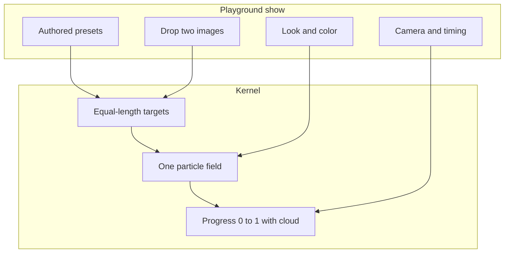

# Personal Particle Morph Kit - Plan

## Goal Capsule

- **Objective:** Ship a personal, shareable particle-morph kit: a tiny engine plus a live playground with authored presets and drop-two-images, on a profile repo that is not Nutricheck.
- **Product authority:** This plan. Nutricheck `/dev/particle-morph` is a frozen visual reference only and is not active scope.
- **Open blockers:** None.

---

## Product Contract

### Summary

A named particle-morph kit on a personal GitHub repo with a live demo. Visitors first watch a few cinematic presets, then can drop two of their own images and morph them. The engine is one particle field that reorganizes between equal-length targets through a controlled cloud. The Nutricheck avatar-to-organ prototype stays untouched.

### Problem Frame

The working morph lives only at a private Nutricheck `/dev` route. It cannot be shown as independent craft, and its scene is hardcoded to avatar, heart, and lungs. Adjacent work (Ionian, TSL demos) is either too heavy or the wrong product. There is no small, owned engine a design engineer can demo, fork, or point to.

### Key Decisions

- **Personal general kit, not a Nutricheck organ product.** (session-settled: user-directed — chosen over a Nutricheck-only organ engine: the work must live on a personal profile.) Governs R1, R2, R14
- **Playground is the v1 product.** (session-settled: user-directed — chosen over a code-only API: it has to be easy to demo and showcase.) Governs R6, R7, R8
- **Morph kit + playground, not a reel or a creative platform.** (session-settled: user-approved — chosen over a presets-only film or a scene-file/export suite: taste in presets plus proof the engine is real.) Governs R6, R7, R9, R10
- **Presets first, then drop-your-own in the same v1.** (session-settled: user-approved — chosen over upload-first and over deferring upload indefinitely: A or B were acceptable; upload-first was not.) Governs R7, R8
- **Freeze the Nutricheck prototype.** (session-settled: user-directed — chosen over refactoring `/dev/particle-morph` in place: that demo stays Nutricheck’s.) Governs R14
- **Rewrite from ideas; original public presets.** Do not paste Nutricheck shaders, scene code, twin URLs, or organ product assets into the public repo. Governs R2, R3

<!-- ce-section: work-relationships -->
### How This Work Fits Together

This plan owns the **personal morph kit and playground**. The broader picture below is current understanding, not a roadmap.

- Personal particle morph kit (this plan)
  - Nutricheck `/dev/particle-morph` prototype
    - Can proceed independently of this plan
    - Shares visual language (one field, cloud phases, semantic morph)
    - Must not be modified by this work
  - Nutricheck production twin / organ-dive integration
    - Can proceed independently of this plan
    - Still to decide whether a future Nutricheck plan consumes ideas from the personal kit
  - Later kit capabilities (mesh/text/SVG authoring, video export, shareable scene URLs)
    - Depends on this plan shipping
    - Deferred; not requirements here

### Actors

- A1. Presenter (you) — runs a 30-second live demo from presets.
- A2. Visitor — opens the live demo, watches presets, may drop two images.
- A3. Downstream developer — reads the public API and drives morphs from code.

### Requirements

**Home and ownership**

- R1. The kit lives in a new personal repository, not inside Nutricheck app routes.
- R2. Public presets and sample assets are original to the kit. They are not Nutricheck avatars, organs, or brand chrome.
- R3. The engine is a rewrite of the proven morph ideas (fixed particle budget, equal-length targets, one field, progress-driven cloud). It is not a copy of Nutricheck product source.

**Engine**

- R4. A show registers named targets. Product code calls a semantic morph (for example `morphTo("wordmark")`), never texture-layer indices.
- R5. One particle population persists through a morph. Source and destination are equal-length targets. The midpoint reads as a controlled cloud, not a crossfade, explosion, or straight-line lerp.
- R6. Look, camera, and timing belong to a show, not to the kernel. The kernel has no organ, avatar, or Nutricheck concepts.

**Playground**

- R7. The live demo opens on authored presets the presenter can click through without uploading files.
- R8. The same demo lets a visitor drop two images and morph them on the same stage.
- R9. Visitor images stay in the browser for that session. They are not uploaded to a server or stored.
- R10. v1 target builders are 2D images. Mesh, text, and SVG authoring are out of v1.
- R11. A documented public API exists so a developer can register targets and morph without using the playground UI.
- R12. `prefers-reduced-motion` shows the selected target in a stable state and skips the cloud.
- R13. The demo remains usable on a phone: one canvas, adaptive quality, pause when hidden.

**Nutricheck boundary**

- R14. Do not change `src/app/dev/particle-morph/` or production twin/organ UI.

### Key Flows

- F1. Presenter demo
  - **Trigger:** A1 opens the live demo.
  - **Actors:** A1
  - **Steps:** First preset is already a stable shape. A1 clicks two or more presets. Each morph uses the same field and a cloud midpoint. Demo completes in about 30 seconds without file pickers.
  - **Outcome:** The kit looks authored and cinematic.
  - **Covered by:** R5, R7, R13

- F2. Visitor morph
  - **Trigger:** A2 drops or chooses two images.
  - **Actors:** A2
  - **Steps:** Both images become equal-length targets. A2 plays the morph on the same stage. Images never leave the browser. Invalid or empty images get a clear in-demo message and do not crash the stage.
  - **Outcome:** A2 believes this is an engine, not a filmed reel.
  - **Covered by:** R5, R8, R9

- F3. Developer morph
  - **Trigger:** A3 follows the README.
  - **Actors:** A3
  - **Steps:** A3 registers at least two named targets from images and calls the semantic morph. Interrupted morphs continue from current progress rather than resetting the field.
  - **Outcome:** The playground is one consumer of the kit, not the only one.
  - **Covered by:** R4, R5, R11

### Acceptance Examples

- AE1. Preset-only first load
  - **Covers:** R7
  - **Given:** A visitor opens the live demo with no files.
  - **When:** The page is ready.
  - **Then:** An authored preset is visible and other presets can be morph-clicked without a file picker.

- AE2. Same field across presets
  - **Covers:** R5
  - **Given:** Preset A is settled.
  - **When:** The visitor morphs to preset B.
  - **Then:** Particles persist through a cloud midpoint. A and B are both recognizable when settled.

- AE3. Two local images
  - **Covers:** R8, R9
  - **Given:** The visitor has two PNG or WebP files.
  - **When:** They drop both onto the stage and play.
  - **Then:** The field morphs between those silhouettes. No network upload of the files occurs.

- AE4. Reduced motion
  - **Covers:** R12
  - **Given:** The visitor prefers reduced motion.
  - **When:** They change preset or drop images.
  - **Then:** The selected target appears in its stable state with no cloud transition.

- AE5. Nutricheck prototype untouched
  - **Covers:** R14
  - **Given:** This kit is implemented in the personal repo.
  - **When:** Nutricheck `/dev/particle-morph` is opened.
  - **Then:** Behavior and files there are unchanged.

### Success Criteria

- A stranger can watch two preset morphs and understand the trick within 30 seconds.
- Drop-two-images works on a phone without looking like a debug page.
- The README states the public API in a few lines a developer can copy.
- The GitHub repo is postable: name, live demo link, original presets, no Nutricheck assets or product source.

### Scope Boundaries

**Deferred for later**

- Mesh, text, and SVG target authoring in the playground.
- Video export, shareable scene URLs, and scene-config files as the authoring surface.
- WebGPU / TSL path.
- Pointer, scroll, or gesture-driven progress.
- Publishing an npm package beyond the repo itself.

**Outside this product's identity**

- A Nutricheck biological-twin or organ-dive feature.
- An Ionian-scale GPGPU engine with mesh sequences, matcaps, and event buses.
- A creative-tool company (accounts, galleries, community).

### Dependencies / Assumptions

- The Nutricheck prototype at `src/app/dev/particle-morph/` remains the private look-dev reference for motion quality.
- Ideas may be taken from `particle-morph-research/` and the 2026-08-30 Nutricheck spec; source code and product assets from Nutricheck must not ship in the personal repo.
- Research third-party licenses (Ionian, TSL demo, and others) still apply if any of those trees are copied; v1 should not vendor those repos.
- Live-demo hosting exists (personal GitHub Pages, Vercel, or equivalent). Choice is planning, not product scope.

### Outstanding Questions

**Deferred to Planning**

- Public name of the kit.
- Hosting and CI for the live demo.
- Exact v1 preset lineup (must satisfy R2).
- License on the personal repo.
- Implementation stack for the playground (as long as R4–R13 hold).

### Sources / Research

- Visual and motion reference (private): `docs/superpowers/specs/2026-08-30-particle-avatar-organ-morph-design.md`, `src/app/dev/particle-morph/`.
- Original product vision (anatomy-specific; this kit generalizes the morph model only): `particle-morph-research/PROJECT_VISION.md`.
- Architectural contrast, not a dependency: Ionian (`particle-morph-research/ionian-main/`) — target independence and semantic progress; rejected for v1 because of weight and missing cloud phase.
